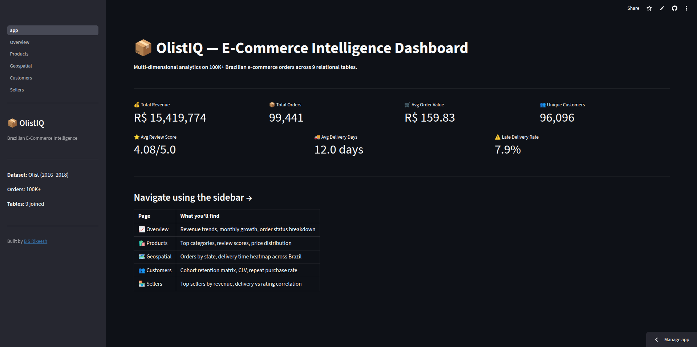

# 📦 OlistIQ — Brazilian E-Commerce Intelligence Dashboard

> A multi-page interactive analytics dashboard built on 100K+ real Brazilian e-commerce orders across 9 relational tables. Covers revenue trends, product analytics, geospatial delivery patterns, customer cohort retention, and seller performance.

🔗 **[Live Demo](#)** · 📓 **[Colab Notebook](notebooks/OlistIQ_Colab.ipynb)**

---

## 🧠 What is this?

Most analytics dashboards plot one CSV with bar charts. OlistIQ joins **9 relational tables**, handles real-world messy data (nulls, duplicates, timezone offsets, Portuguese category names), builds **cohort retention from scratch**, and renders a **geospatial heatmap of Brazil**. That's data engineering + analytics + visualization in one project.

**Business questions it answers:**
- Which product categories drive the most revenue?
- Which Brazilian states have the worst delivery times?
- Are customers coming back after their first purchase?
- Which sellers have the best review scores relative to delivery speed?
- What does customer lifetime value look like across the base?

---

## 🖥️ Demo



---

## 🏗️ Architecture

```
9 CSV files (raw Olist data)
      ↓
pandas — join, clean, feature engineer
      ↓
Cached DataFrames (@st.cache_data)
      ↓
5-page Streamlit dashboard
      ├── 📈 Overview      — KPIs, revenue trend, order status
      ├── 🛍️ Products      — category revenue, review scores, price analysis
      ├── 🗺️ Geospatial    — Brazil choropleth, delivery heatmap
      ├── 👥 Customers     — cohort retention matrix, CLV, repeat rate
      └── 🏪 Sellers       — top sellers, delivery vs rating correlation
```

---

## 📊 Dataset

**Olist Brazilian E-Commerce Public Dataset** (Kaggle)
- 100,000+ orders · 2016–2018
- 9 CSV files — orders, customers, sellers, products, reviews, payments, geolocation, order items, category translations
- Real-world messy data — nulls, duplicates, timezone offsets, Portuguese category names

Download: [kaggle.com/datasets/olistbr/brazilian-ecommerce](https://www.kaggle.com/datasets/olistbr/brazilian-ecommerce)

> **Note:** CSVs are not committed to this repo (100MB+). Download from Kaggle and place in `data/`.

---

## 🚀 Run Locally

```bash
git clone https://github.com/bsrikeesh/olistiq-dashboard.git
cd olistiq-dashboard
pip install -r requirements.txt

# Download dataset from Kaggle and place all 9 CSVs in data/
mkdir data
# ... place CSVs here ...

streamlit run app.py
```

Opens at `http://localhost:8501`

---

## 📁 Project Structure

```
olistiq-dashboard/
├── app.py                    # Main Streamlit entry point + navigation
├── requirements.txt
├── utils/
│   └── data_loader.py        # All data loading, joining, feature engineering
├── pages/
│   ├── 1_Overview.py         # KPIs + revenue trend
│   ├── 2_Products.py         # Category analytics
│   ├── 3_Geospatial.py       # Brazil state maps
│   ├── 4_Customers.py        # Cohort retention + CLV
│   └── 5_Sellers.py          # Seller performance
├── notebooks/
│   └── OlistIQ_Colab.ipynb   # Full analysis in Google Colab
├── assets/
│   └── demo.png
├── .gitignore
└── README.md
```

---

## ⚙️ Key Technical Challenges

| Challenge | Solution |
|-----------|----------|
| Joining 9 tables without row explosion | Careful merge order — orders as spine, aggregate payments + reviews before joining |
| Portuguese category names | Merge with `product_category_name_translation.csv` |
| Cohort analysis from scratch | Extract first purchase month per customer, pivot into retention matrix |
| Brazil state choropleth | Plotly choropleth + Brazil GeoJSON with state code mapping |
| Performance on 100K rows | `@st.cache_data` on all loading functions |
| Late delivery detection | Compare `order_delivered_customer_date` vs `order_estimated_delivery_date` |

---

## 🛠️ Tech Stack

| Layer | Tool |
|-------|------|
| Data processing | pandas, numpy |
| Visualization | Plotly Express + Plotly Graph Objects |
| Dashboard | Streamlit |
| Maps | Plotly choropleth + Brazil GeoJSON |
| Notebook | Google Colab |
| Deployment | Streamlit Community Cloud |

---

## 📈 Key Insights from the Data

- São Paulo accounts for the majority of both customers and sellers
- Average delivery time varies significantly by state — northern states wait 2–3x longer
- Faster delivery strongly correlates with higher review scores (negative correlation)
- Cohort retention drops sharply after Month 1 — most customers don't repeat purchase
- Health & Beauty and Bed/Bath/Table are the top revenue categories

---

## 👤 Author

**B S Rikeesh**
ECE Graduate · GITAM University, Bengaluru
AI/ML Engineer · GenAI Developer · ServiceNow CSA

[](https://linkedin.com/in/bsrikeesh)
[](https://github.com/bsrikeesh)

---

## 📜 License

MIT License — free to use, modify, and deploy.
